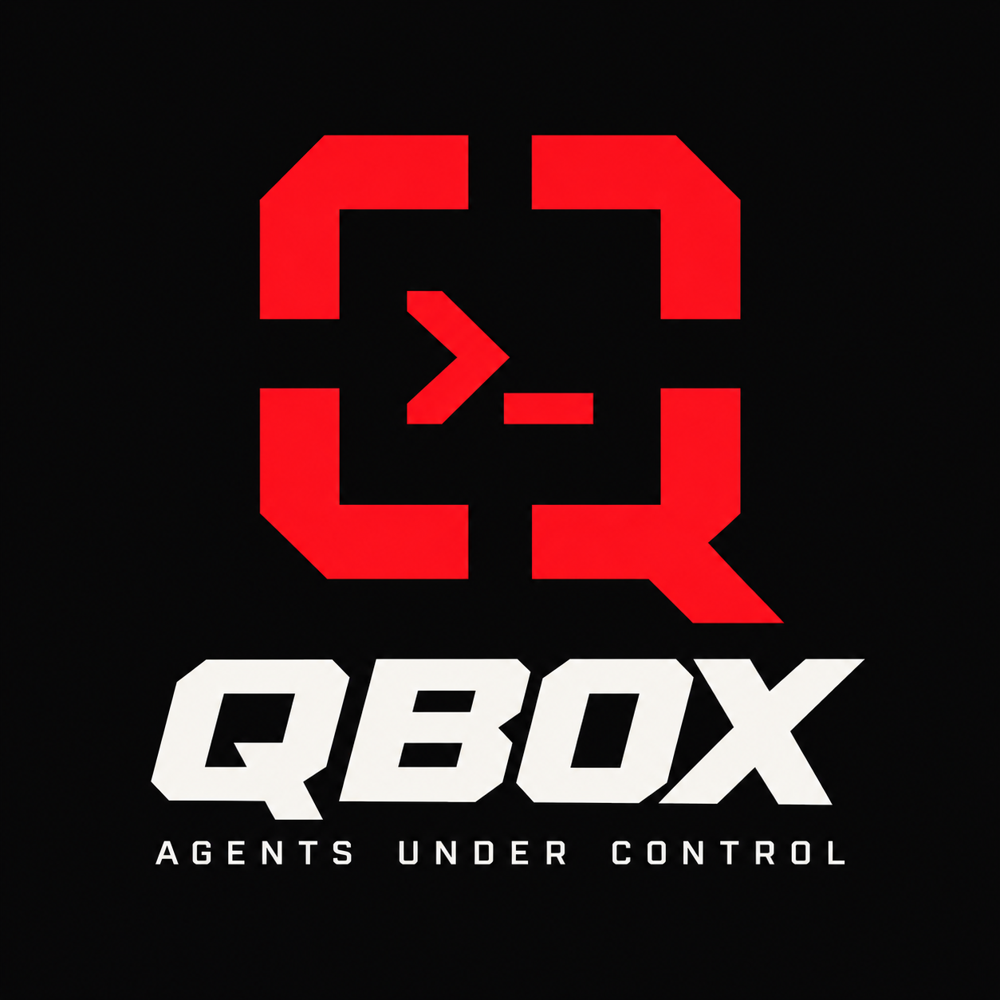
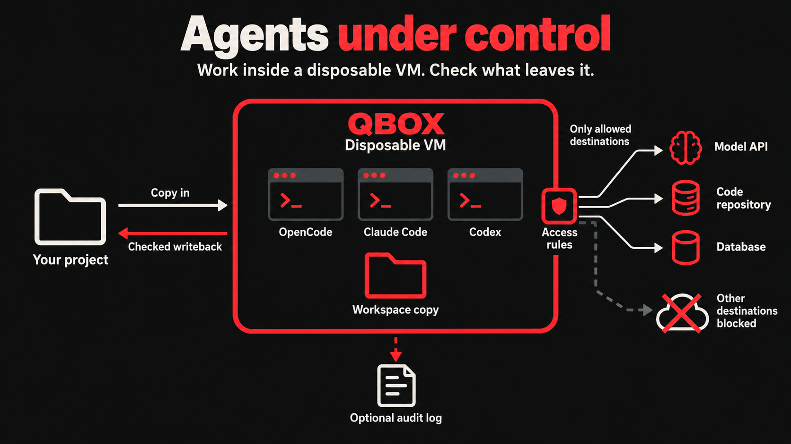

# QBox

<p align="center">
  
</p>

Run coding agents or an architecture-compatible Linux ELF inside a disposable QEMU VM. The host
launcher uses ordinary user privileges, forwards binary stdio and exit status,
and denies outbound traffic except explicit TCP destination capabilities.



QBox's distinctive combination is Windows and macOS support, stock QEMU,
rootless operation, architecture-compatible Linux ELF execution, coding-agent
mode, deny-by-default hostname-and-port capabilities, and explicit credential
forwarding through the authenticated runner channel. This combination appears
distinctive among the alternatives reviewed so far.

See [architecture.md](architecture.md) for diagrams of the VM, execution flow,
network controls, and workspace writeback.

`qbox agent` supports headless jobs and interactive terminals (`--tty`), with a
private workspace snapshot and automatic writeback after the command exits.
Use an agent image containing the installed Linux version of Claude Code, Codex, OpenCode,
or another CLI and its tools. See [agent setup and examples](docs/agents.md).
The minimal image used by `qbox run` contains only the runner.

## Quick start: OpenCode

Install QEMU, CMake, a C++ compiler, Python 3, curl, and Zig (for the static Linux
guest runner) using the [platform instructions below](#install-dependencies).
Run these commands from the repository root. This example uses
an aarch64 guest on Apple Silicon; on an x86_64 host, replace `aarch64` with
`x86_64` in the commands and paths. See [guest build instructions](guest/README.md)
for other Linux compiler options and [platform notes](docs/platforms.md) for Windows.

```sh
cmake -S . -B build -DCMAKE_BUILD_TYPE=Release
cmake --build build --parallel

CC='zig cc -target aarch64-linux-musl' guest/build-guest.sh aarch64 assets/aarch64
python3 guest/prepare-agent-image.py --arch aarch64 --with-build-tools
```

The assembler downloads an Alpine kernel/userspace and checksum-verified
OpenCode, Codex, and Claude Code binaries into ignored local directories.
It produces the kernel, agent image, minimal image, and provenance manifest.
`--with-build-tools` includes CMake, Ninja, Make, GCC/G++, and Linux development
headers so agents can build C/C++ projects. Tools installed on your host are
not available inside the VM. Add other guest packages with repeatable
`--package NAME` options; see [guest tooling](docs/agents.md#guest-project-tools).

Start OpenCode with its built-in free provider experience; no API key is
required for this quick start:

```sh
build/qbox agent --workspace /absolute/path/to/your/project --tty \
  --kernel assets/aarch64/vmlinuz --initrd assets/aarch64/agents.img \
  --allow opencode.ai:443 \
  -- opencode
```

Use `/models` in OpenCode to select an available **Free** model from OpenCode
Zen. QBox allows access to `opencode.ai:443`, which serves these models.
The guest starts with a disposable home, so host provider logins and model
history are not imported. A project's `opencode.json` can still select a model;
choose a free Zen model for this flow.

To download source code and give the agent access to a PostgreSQL database,
allow the repository host and database endpoint alongside the model provider.
Set `DATABASE_URL` in your host shell to your database connection string, and
replace `db.example.com` with its publicly reachable hostname:

```sh
build/qbox agent --workspace /absolute/path/to/your/project --tty \
  --kernel assets/aarch64/vmlinuz --initrd assets/aarch64/agents.img \
  --allow opencode.ai:443 \
  --allow github.com:443 \
  --allow db.example.com:5432 --env DATABASE_URL \
  -- bash -c 'git clone https://github.com/nolasoft/qbox.git qbox-source && cd qbox-source && exec opencode'
```

This downloads the public QBox repository into `qbox-source` inside the guest
workspace and starts OpenCode there. Use a fresh destination directory; the
downloaded code and subsequent edits are written back to your host project.
Replace the repository URL and allowed host for your own source repository.
The database hostname and port in `DATABASE_URL` must match the allowed
endpoint. Private/localhost database addresses are blocked by QBox's current
network policy. Include the project's database driver or client tools in the
guest image. `--allow` permits a TCP destination; repository and database
authentication and permissions still apply.

For a headless job, omit `--tty` and select a free model explicitly after `--`:

```sh
opencode run --model opencode/longcat-2.5-preview-free \
  "Implement the requested change and run the relevant tests"
```

Free-model availability and usage limits are controlled by OpenCode and can
change; see [OpenCode Zen](https://opencode.ai/docs/zen). If the example model
is unavailable, choose another Free model shown by `/models`.

QBox copies your project into a disposable VM and automatically writes edits
back when the agent exits, checking for conflicting host changes. Outbound TCP
is permitted only to the listed destination. Exit OpenCode normally to retain
edits. To work on this repository,
use `--workspace "$PWD" --exclude build --exclude assets`.
See [agent setup](docs/agents.md#opencode) for other providers, additional network
destinations, and optional eBPF auditing.

For terminal copy/paste, use the host terminal's Copy/Paste commands. In Apple
Terminal, select text and press Cmd+C; paste with Cmd+V. OpenCode's own “Copied”
notification can leave the Mac clipboard unchanged because Apple Terminal does
not support its OSC 52 clipboard sequence. See
[TTY copy/paste](docs/agents.md#copy-and-paste) for selection modifiers and
compatible terminals.

### Enable auditing and get a report

Prepare an image with the eBPF collector as well as the project build tools.
Install a BPF-capable Clang first: `brew install llvm` on macOS, or
`sudo apt install --yes clang llvm` on Ubuntu/Debian (including Windows' WSL
image-building environment). Then, from the repository root:

```sh
qbox_bpf_clang=clang
if [ "$(uname -s)" = Darwin ]; then
  qbox_bpf_clang="$(brew --prefix llvm)/bin/clang"
fi
python3 guest/prepare-agent-image.py --arch aarch64 --with-build-tools \
  --with-audit --cc 'zig cc -target aarch64-linux-musl' \
  --bpf-clang "$qbox_bpf_clang"
```

Use `x86_64` in both `--arch` and the Zig target for an x86 guest. On Windows,
prepare the image in WSL and copy the updated artifacts into your Windows
checkout as described below. The ordinary image lacks the audit collector;
`--audit-log` requires this audited `agents.img`.

Start an audited OpenCode session against `~/pippo25`. A fresh directory keeps
the log outside the project and avoids overwriting an earlier session:

```sh
qbox_audit_dir="$(mktemp -d "${TMPDIR:-/tmp}/qbox-audit.XXXXXX")"
qbox_audit_log="$qbox_audit_dir/session.jsonl"
build/qbox agent --workspace "$HOME/pippo25" --tty \
  --kernel assets/aarch64/vmlinuz --initrd assets/aarch64/agents.img \
  --allow opencode.ai:443 --audit-log "$qbox_audit_log" \
  -- opencode
printf 'Audit log: %s\n' "$qbox_audit_log"
```

Exit OpenCode normally, then run the following in the same host shell to print
a report. The JSONL log is available during the session; its final completion
record is written when the audit finishes.

```sh
python3 - "$qbox_audit_log" <<'PY'
import json
import sys
from collections import Counter
from pathlib import Path

path = Path(sys.argv[1])
records = []
malformed = False
with path.open() as stream:
    for number, line in enumerate(stream, 1):
        try:
            records.append(json.loads(line))
        except json.JSONDecodeError:
            print(f"Unreadable record at line {number}; audit is incomplete.")
            malformed = True
            break
events = [r for r in records if r.get("event") not in ("session", "completion")]
last = records[-1] if records else {}
complete = (not malformed and last.get("event") == "completion"
            and last.get("complete") is True and last.get("lost") == 0
            and last.get("events") == last.get("guest_events") == len(events))
print(f"Audit: {path}")
print("Status:", "COMPLETE" if complete else "INCOMPLETE")
print("Events:", len(events), "| Lost:", last.get("lost", "unknown"))
for name, count in sorted(Counter(r["event"] for r in events).items()):
    print(f"  {name}: {count}")
print("Executed programs:")
for executable, count in sorted(Counter(r["executable"] for r in events
                                        if r["event"] == "exec").items()):
    print(f"  {count:>5}  {executable}")
print("Connection attempts (guest addresses):")
for (address, port), count in sorted(Counter((r["address"], r["port"])
                                            for r in events
                                            if r["event"] == "connect_attempt").items()):
    print(f"  {count:>5}  {address}:{port}")
sys.exit(0 if complete else 1)
PY
```

To keep a text report, add `> "$qbox_audit_dir/report.txt"` immediately before
`<<'PY'` in the command above. `Status: COMPLETE` confirms the collector finished
without reported event loss; missing, truncated, or unsuccessful completion
produces `INCOMPLETE` and a nonzero report exit status. The report summarizes
process and connection metadata, not prompts, file contents, or network
payloads. Guest connection attempts may use synthetic addresses such as
`10.0.2.100`; they do not prove an upstream connection was allowed. See
[audit details](docs/agents.md#optional-ebpf-audit) for coverage and failure behavior.

## Agent examples

These examples use the prepared agent image and API-key authentication. Set the
named variable in your host shell before launching; QBox forwards only variables
selected with `--env`. Replace `/absolute/path/to/your/project` with your project
directory. Use `x86_64` artifact paths on x86 hosts, and
`build-windows/qbox.exe` in the Windows UCRT64 terminal.

### Codex (headless)

Set `CODEX_API_KEY` to your OpenAI API key, then run:

```sh
build/qbox agent --workspace /absolute/path/to/your/project \
  --kernel assets/aarch64/vmlinuz --initrd assets/aarch64/agents.img \
  --env CODEX_API_KEY --allow api.openai.com:443 \
  -- codex exec --skip-git-repo-check --sandbox workspace-write \
  "Fix the failing tests and explain the changes"
```

`--skip-git-repo-check` is needed because QBox excludes the host `.git`
directory. `CODEX_API_KEY` supports noninteractive execution; see the
[official Codex noninteractive guide](https://developers.openai.com/codex/noninteractive).

### Claude Code

Set `ANTHROPIC_API_KEY` to your Anthropic API key. Start an interactive session:

```sh
build/qbox agent --workspace /absolute/path/to/your/project --tty \
  --kernel assets/aarch64/vmlinuz --initrd assets/aarch64/agents.img \
  --env ANTHROPIC_API_KEY --allow api.anthropic.com:443 \
  -- claude
```

Or run a headless job with explicit tool permissions:

```sh
build/qbox agent --workspace /absolute/path/to/your/project \
  --kernel assets/aarch64/vmlinuz --initrd assets/aarch64/agents.img \
  --env ANTHROPIC_API_KEY --allow api.anthropic.com:443 \
  -- claude -p "Fix the failing tests and explain the changes" \
  --allowedTools "Read,Edit,Write,Bash"
```

See [Claude Code's programmatic usage guide](https://code.claude.com/docs/en/headless).

### OpenCode with DeepSeek

Set `DEEPSEEK_API_KEY` to your DeepSeek API key. Start an interactive session
using DeepSeek V4 Pro:

```sh
build/qbox agent --workspace /absolute/path/to/your/project --tty \
  --kernel assets/aarch64/vmlinuz --initrd assets/aarch64/agents.img \
  --env DEEPSEEK_API_KEY --allow api.deepseek.com:443 \
  -- opencode --model deepseek/deepseek-v4-pro
```

Or run a headless job:

```sh
build/qbox agent --workspace /absolute/path/to/your/project \
  --kernel assets/aarch64/vmlinuz --initrd assets/aarch64/agents.img \
  --env DEEPSEEK_API_KEY --allow api.deepseek.com:443 \
  -- opencode run --model deepseek/deepseek-v4-pro \
  "Fix the failing tests and explain the changes"
```

The pinned OpenCode image includes this model in its bundled catalog. Configure
OpenCode's project permissions in `opencode.json` for tools your headless job
needs. See [OpenCode's DeepSeek setup](https://opencode.ai/docs/providers/#deepseek)
and [DeepSeek's coding-agent guide](https://api-docs.deepseek.com/guides/coding_agents/).

All examples automatically write workspace edits back after a complete export.
The listed capability permits only the provider API; package installs, Git
remotes, MCP services, and other external tools need their own `--allow` entries.
To run against this repository, use `--workspace "$PWD" --exclude build --exclude assets`.

## Install dependencies

### macOS

Install Apple's command-line tools for Clang/C++ and Make:

```sh
xcode-select --install
```

Install [Homebrew](https://brew.sh/) if needed, then install the remaining tools:

```sh
brew install qemu cmake python curl zig
```

Open a new terminal after installation. The OpenCode quick start above uses
Apple Silicon; Intel Macs should use `x86_64`. See the
[QEMU download guide](https://www.qemu.org/download/) and
[Zig installation guide](https://ziglang.org/learn/getting-started/).

### Linux (Ubuntu / Debian)

Install the host compiler, build tools, Python, curl, and both QEMU system targets:

```sh
sudo apt update
sudo apt install --yes build-essential cmake python3 curl ca-certificates \
  xz-utils qemu-system-x86 qemu-system-arm
```

Install Zig separately. The following uses Zig 0.15.2, the version used to
validate QBox's guest builds. Choose the archive matching your Linux host:

```sh
case "$(uname -m)" in
  x86_64) qbox_zig_arch=x86_64 ;;
  aarch64|arm64) qbox_zig_arch=aarch64 ;;
  *) echo 'Download Zig for your host architecture from ziglang.org'; exit 1 ;;
esac
mkdir -p "$HOME/.local/opt"
curl --proto '=https' --proto-redir '=https' -fL \
  "https://ziglang.org/download/0.15.2/zig-${qbox_zig_arch}-linux-0.15.2.tar.xz" \
  -o /tmp/qbox-zig-0.15.2.tar.xz
tar -xJf /tmp/qbox-zig-0.15.2.tar.xz -C "$HOME/.local/opt"
export PATH="$HOME/.local/opt/zig-${qbox_zig_arch}-linux-0.15.2:$PATH"
zig version
```

Add the same PATH entry to your shell startup file to keep Zig available in
future terminals. Official downloads and verification information are available
on the [Zig download page](https://ziglang.org/download/).
For other distributions, install equivalent packages through their package
manager and use the same Zig setup. Run the quick start with your guest
architecture (`x86_64` on an x86 Linux host).

### Windows (x86_64)

Install [MSYS2](https://www.msys2.org/), open its **UCRT64** terminal, and update
it. If prompted to close the terminal, reopen UCRT64 and repeat the update:

```sh
pacman -Syu
```

Install native Windows QEMU, CMake, GCC/C++, Python, curl, and Ninja:

```sh
pacman -S --needed mingw-w64-ucrt-x86_64-qemu \
  mingw-w64-ucrt-x86_64-cmake mingw-w64-ucrt-x86_64-gcc \
  mingw-w64-ucrt-x86_64-python mingw-w64-ucrt-x86_64-curl \
  mingw-w64-ucrt-x86_64-ninja
```

Keep using the UCRT64 terminal so these tools remain on PATH. From the
repository root, build the Windows launcher with a separate build directory:

```sh
cmake -S . -B build-windows -G Ninja -DCMAKE_BUILD_TYPE=Release
cmake --build build-windows --parallel
```

See [MSYS2's CMake guidance](https://www.msys2.org/docs/cmake/) and its
[QEMU package](https://packages.msys2.org/packages/mingw-w64-ucrt-x86_64-qemu).

Prepare Linux guest images in WSL, where Linux permissions and symlinks are
preserved. Install Ubuntu from an Administrator PowerShell terminal, then
restart if requested and finish the Ubuntu account setup:

```powershell
wsl --install -d Ubuntu
```

In Ubuntu, follow the Linux dependency and Zig instructions above. Copy the
repository into the WSL Linux filesystem (for example, `~/qbox`), then run:

```sh
cd ~/qbox
CC='zig cc -target x86_64-linux-musl' guest/build-guest.sh x86_64 assets/x86_64
python3 guest/prepare-agent-image.py --arch x86_64 --with-build-tools
```

Copy `vmlinuz` and `agents.img` from WSL's `assets/x86_64` into the Windows
checkout's `assets/x86_64`. Launch the native `build-windows/qbox.exe` from
UCRT64 using the quick-start command with `x86_64` paths. WSL and Zig are
needed for image preparation; ordinary Windows sessions use native QEMU.
See [Microsoft's WSL installation instructions](https://learn.microsoft.com/en-us/windows/wsl/install).

Enable **Windows Hypervisor Platform** in “Turn Windows features on or off”
and restart to use WHPX acceleration. Alternatively, pass `--accel tcg` to
use software emulation. See [platform notes](docs/platforms.md) for current
Windows validation status.

### Check the installation

In the terminal used to build and run QBox:

```sh
cmake --version
c++ --version
python3 --version
curl --version
qemu-system-x86_64 --version
```

On macOS/Linux, also check `zig version`; on Apple Silicon, check
`qemu-system-aarch64 --version`. On Windows, check Zig inside WSL.
These installation steps cover the standard agent image. Optional eBPF
auditing also requires a BPF-capable Clang and the
[audit build setup](guest/README.md#building-with-ebpf-auditing).

## Run a Linux executable

```sh
cmake -S . -B build -DCMAKE_BUILD_TYPE=Release
cmake --build build --parallel
ctest --test-dir build --output-on-failure

build/qbox run --memory 256 \
  --kernel assets/aarch64/vmlinuz --initrd assets/aarch64/initramfs.img \
  --allow api.example.com:443 -- ./program arg1 arg2
```

Install QEMU separately and build the guest artifacts using [guest/README.md](guest/README.md).
The repository does not include kernels, initramfs images, or downloaded binaries.
Default installed artifact paths are `share/qbox/<architecture>/{vmlinuz,initramfs.img}`
relative to the install prefix. `qbox-connector` belongs beside `qbox`.
For Visual Studio builds, executables are normally in `build/Release`.

The default guest matches the host: aarch64 on Apple Silicon and x86_64 on
Windows x86_64 or Intel macOS. Automatic acceleration selects HVF on macOS,
WHPX on Windows, and KVM on Linux, with a TCG retry if QEMU exits before connecting.
Use `--accel tcg` to force emulation;
cross-architecture execution also requires this option. Windows ARM64 is currently
an experimental profile requiring a suitable QEMU build.

`--timeout` defaults to 300 seconds, including boot. Runner startup is limited to
30 seconds. `--output-limit` defaults to 64 MiB combined stdout/stderr. Memory is
32–65536 MiB, one virtual CPU is allocated, and at most 32 capabilities are allowed.
Launcher failures return 125; guest exits retain their code; guest signals return
128 plus the Linux signal number. Ctrl-C requests SIGINT and allows two seconds
before destroying the VM.

Each distinct permitted host gets an address starting at `10.0.2.100`; multiple
ports for the same host share that address. DNS names resolve through the guest's
generated `/etc/hosts`; fresh host DNS resolution happens on each forwarded
connection. Public IP literals are accepted (IPv6 must be bracketed) but programs
must connect to their **synthetic IPv4 endpoint**, not the original numeric IP.
For example, `--allow 1.1.1.1:80` exposes `10.0.2.100:80`. Numeric `getaddrinfo`
bypasses `/etc/hosts`; transparent numeric-address translation is not implemented.
IPv6 is disabled inside the guest; the host connector can connect to public IPv6.

Use static Linux executables for the first slice. Dynamic ELF programs require
their matching Linux loader and libraries in the initramfs; macOS Mach-O and
Windows PE executables cannot run in this guest. For HTTPS, include a CA bundle
in the guest image. The connector relays TCP without interpreting HTTP or TLS.

The guest `/init` is the statically linked C runner itself. On macOS/Linux it mounts
the payload read-only, copies the program to tmpfs and unmounts the host share.
Windows uses a per-run initramfs archive because QEMU's local 9P backend is POSIX
only; its boot payload is copied to tmpfs and deleted. `--payload-mode initrd`
also selects this path on POSIX. The runner then configures the network and starts
the program as UID/GID 65534. No host environment variables
are forwarded unless explicitly selected with agent mode's `--env NAME`.
QEMU's `restrict=on` applies independently of guest cooperation.
The connector validates every resolved sockaddr and connects to that exact
address; loopback, private, link-local, documentation and other special ranges
are rejected. DNS and connection timeouts are 10 seconds each, and relay idle
timeout is 120 seconds. The host/runner protocol has a 1 MiB frame limit.

The current implementation is an MVP, not a production multi-tenant sandbox.
QEMU, Linux, virtio, boot-time 9P and the connector remain part of its attack surface.
The guest retains the 9P device after unmounting, but the child has no mount
privileges. Host QEMU diagnostic logs are temporary and their last 8 KiB is printed
on failures; VM memory and application output are bounded, diagnostic file size
is not currently capped. QEMU-spawned connectors watch a private per-run lease
file, so VM teardown also stops helpers waiting for DNS, connection, or I/O.

Local tests cover parsing/address policy, exact-address multi-answer fallback,
the actual connector's private-DNS rejection, the real runner protocol, and
launcher lifecycle using a fake QEMU peer. The fake
peer does **not** establish VM isolation. Run the separate [integration suite](tests/integration.py)
with real artifacts:

```sh
python3 tests/integration.py --qbox build/qbox --assets assets/aarch64 \
  --arch aarch64 --accel tcg --network-host example.com
```

It covers hello, exit 42, binary echo, large output, crashes, timeouts, cancellation,
cleanup, default-deny and optional allowed/wrong-port/other-host/private-DNS cases.
Multi-answer policy is tested deterministically by the core suite; public network
tests require an available HTTP endpoint. See [protocol](docs/protocol.md) and
[platform validation](docs/platforms.md) for the wire format and verification status.

Agent sessions optionally accept `--audit-log PATH` for trusted guest eBPF process
and connection metadata. See [audit setup and behavior](docs/agents.md#optional-ebpf-audit).

## License

QBox is licensed under [MIT](LICENSE). The eBPF program is dual-licensed under
MIT or GPL-2.0-only. Downloaded components retain their own licenses; see
[third-party notices](THIRD_PARTY_NOTICES.md) before distributing guest images.
