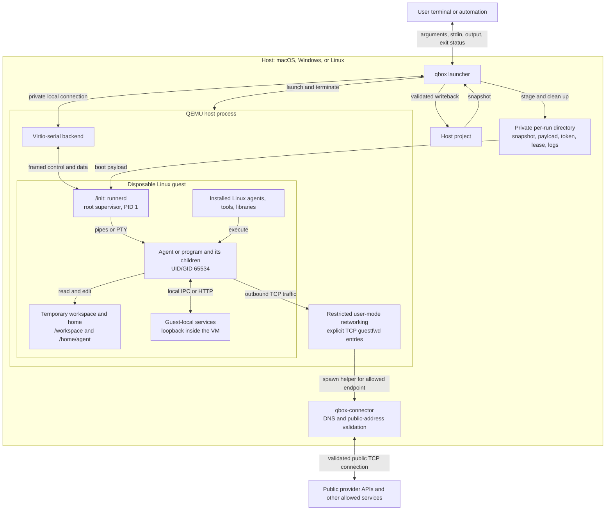
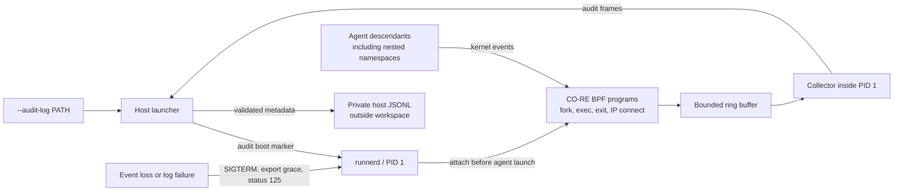
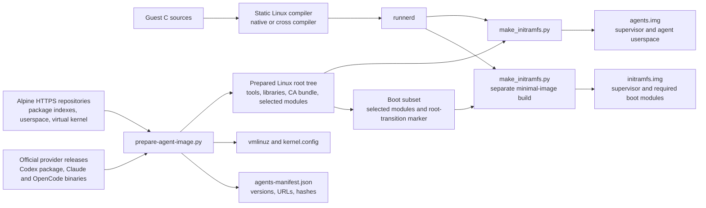
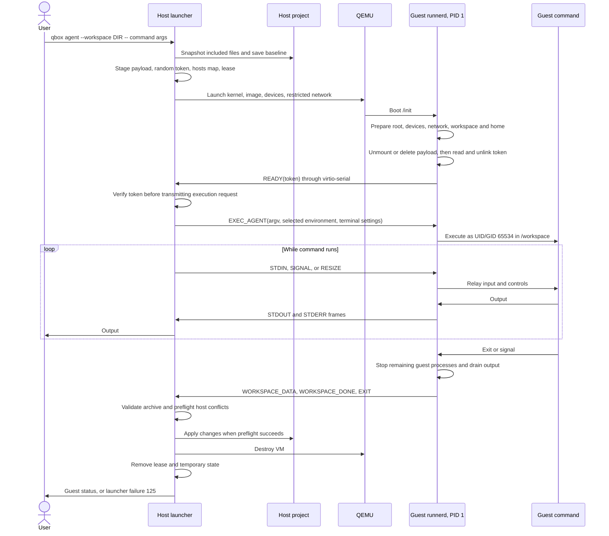
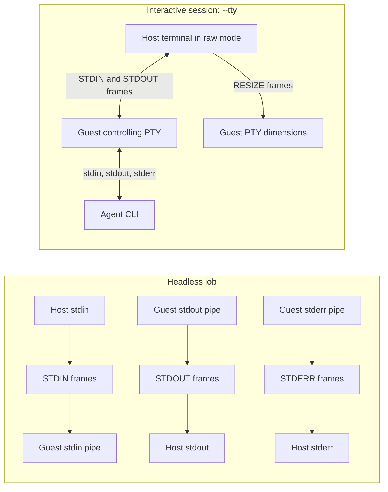
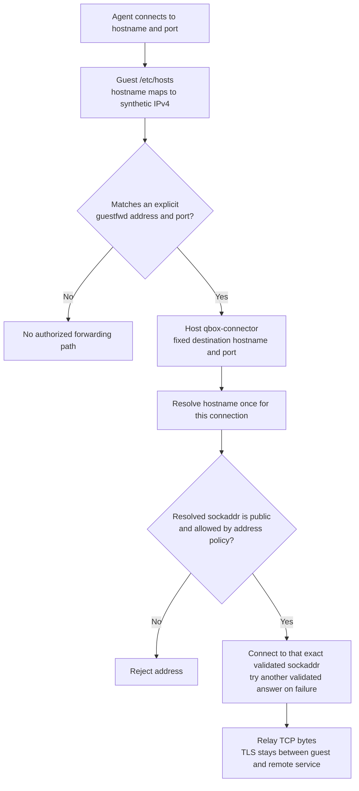
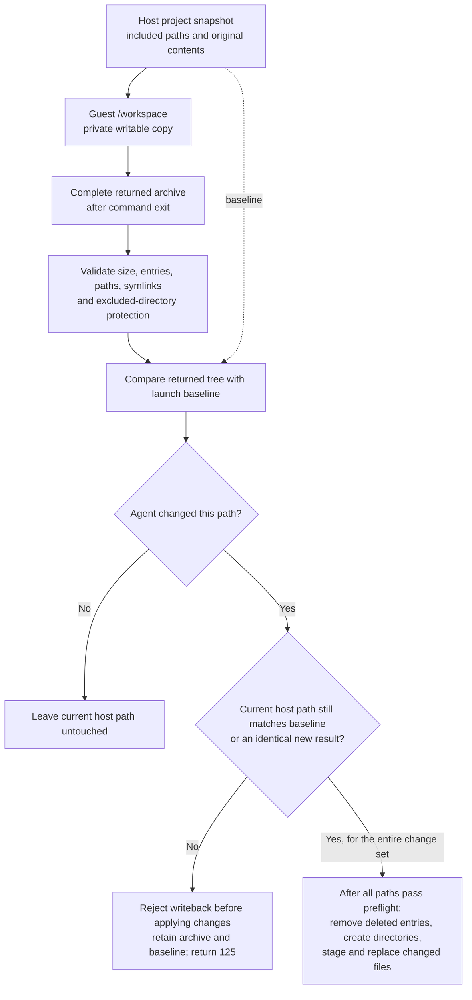

# QBox architecture

QBox runs one command and its children in a disposable Linux VM. The host
launcher owns the VM's lifetime, terminal connection, network capabilities,
and workspace synchronization. Agents such as Claude Code, Codex, and OpenCode are ordinary
Linux programs inside that VM.

The diagrams use Mermaid and render in GitHub and other Mermaid-enabled Markdown
viewers. They describe the current implementation.

## Components and boundaries

The guest receives a copy of the project. Its edits reach the host through the
launcher’s writeback code. Boot-time 9P is read-only and unmounted before the
command runs; the alternative initrd payload is consumed and deleted.

The host launcher runs with ordinary user privileges. QEMU and the guest kernel
provide the VM boundary. Inside the guest, the root supervisor keeps the control
device and authentication token away from the unprivileged command. The agent
may use its own Linux sandbox, such as Codex's bubblewrap, within this boundary.

## Optional trusted guest audit

Auditing is explicitly requested per session. The audited image contains a
static libbpf collector and `/etc/qbox/audit.bpf.o`; the kernel supplies BTF and
tracing support. Audit readiness is checked after token authentication and
before command/environment delivery. A launch barrier registers the initial
agent before execution; fork tracing follows its descendants by initial guest
namespace task IDs, independent of their current UID or namespace.

The collector lives inside PID 1 and survives `kill(-1)` cleanup. It detaches
and drains after descendants are reaped, then sends completion metadata before
EXIT. The host writes a bounded, private JSONL log and still applies workspace
exports after an audit failure. Arguments, environment and payload bytes are
omitted. QEMU and the host connector enforce network policy; these probes only
observe process lifecycle and IP connection attempts. No BPF privileges are
given to agents.

## Preparing the images

The assembler checks APK control/data checksums against the downloaded index
and provider binaries against published SHA256 digests. Index trust comes from
HTTPS; independent Alpine signing-key verification is not implemented. Downloads
and generated artifacts stay in ignored `build/` and `assets/` directories.

The image determines which project tools agents can use. Host-installed tools
are not exposed inside the VM. `--with-build-tools` adds C/C++ compilers, headers,
Make, CMake, and Ninja; repeatable `--package NAME` options include additional
Alpine dependencies before the root tree is packed.

The prepared image uses a tmpfs root so bubblewrap can pivot roots and create
user namespaces. PID 1 copies the initial filesystem, releases its old files,
and moves the new mount to `/`. It then mounts proc/sys/dev and loads the trusted
module list needed by the distribution kernel. Custom kernels with built-in
drivers can omit the module list. The root transition remains necessary for
image tools that need to pivot roots or create unprivileged user namespaces.

Codex is packaged under `/opt/codex`, including its server and helpers. Claude
Code, the Codex link, and the OpenCode launcher are available through `/usr/local/bin`.
OpenCode uses a pinned musl binary under `/opt/opencode`; its launcher disables
updates and model-catalog downloads by default, and directs native-library
extraction to a temporary directory in the disposable home. Guest loopback is enabled for
local agent services, with no host port exposure. Guest account
homes and credentials are created at runtime rather than packaged in the image.

## Boot and execution

`qbox run` follows the same lifecycle but stages a host-supplied Linux ELF,
sends `EXEC`, and skips workspace snapshot/export. `qbox agent` executes an
installed guest command and sends `EXEC_AGENT`. Agent mode defaults to 4 GiB RAM
and a one-hour timeout; ordinary run mode defaults to 256 MiB and five minutes.

The control connection is a private Unix socket on POSIX or authenticated
loopback TCP on Windows. QEMU connects to the host listener and bridges it to
`qbox.runner` virtio-serial. Frames are binary with a one-byte type, four-byte
length, and a maximum 1 MiB payload. Token verification identifies the expected
runner; the local transport is not an encrypted protocol.

## Headless and interactive I/O

Headless output streams stay separate and preserve binary data. A PTY combines
stdout/stderr and lets the agent use terminal controls. Ctrl-C is forwarded to
the guest terminal in interactive mode; Ctrl-] asks QBox to terminate the session
with SIGTERM and allows up to 30 seconds for shutdown/export. Terminal settings
are restored when the launcher exits.

Only variables named by `--env NAME` are forwarded alongside the guest's fixed
environment. Credentials travel in the execution frame, not QEMU arguments.
The private guest home disappears when the VM is destroyed.

## Outbound network capabilities

For example, `--allow api.openai.com:443` creates a synthetic address such as
`10.0.2.100` and a forwarding entry for that address and port.

QEMU uses `restrict=on`; the guest cannot widen the host's forwarding rules.
The connector resolves afresh for each connection, rejects private/loopback/
link-local and other special addresses, and connects to the exact sockaddr it
checked. It does not resolve the name again between validation and connection.
Allowed hostnames do not authorize redirects to other names or different ports.

There is no general guest DNS service or inbound forwarding. IPv6 is disabled
in the guest, while the connector can reach validated public IPv6 endpoints.
Numeric destinations must use their assigned synthetic IPv4 address. Helpers
watch a per-run lease file and stop when the launcher removes it during cleanup.

## Workspace writeback

`.git`, `.qbox-results`, and `.DS_Store` are excluded by default; `--exclude`
adds top-level names. Snapshot and export each default to a 512 MiB limit.
Archives support directories, regular files, and contained relative symlinks;
symlink targets containing `..` are rejected. Host and guest validate archives
independently. The host also checks that writeback does not follow symlink parents.

Writeback happens after complete export, including nonzero command exits.
Concurrent host edits to untouched paths survive. Conflicting edits prevent
preflight from succeeding and leave recoverable private temporary state.
Replacement is atomic per file, not across the project; concurrent changes or
I/O failures during application can leave some edits applied. A VM crash or
forced termination before export can lose guest edits.

## Platforms and implementation map

| Concern | Implementation |
|---|---|
| CLI parsing, resource limits, capability mapping, QEMU arguments | [src/config.cpp](src/config.cpp) |
| VM lifecycle, authentication, frame relay, writeback orchestration | [src/launcher.cpp](src/launcher.cpp) |
| Processes, private directories, sockets, OS cleanup | [src/platform.cpp](src/platform.cpp) |
| TCP connector and public-address connection policy | [src/connector.cpp](src/connector.cpp), [src/connect_policy.hpp](src/connect_policy.hpp) |
| Frame format and execution environment | [src/protocol.cpp](src/protocol.cpp), [docs/protocol.md](docs/protocol.md) |
| Host snapshot, archive validation, conflict checks, file replacement | [src/workspace.cpp](src/workspace.cpp) |
| Host terminal handling and initrd payload injection | [src/terminal.cpp](src/terminal.cpp), [src/payload.cpp](src/payload.cpp) |
| Trusted eBPF collector and probes | [guest/audit.c](guest/audit.c), [guest/audit.bpf.c](guest/audit.bpf.c) |
| Host audit validation and JSONL output | [src/audit.cpp](src/audit.cpp) |
| Guest boot, process supervision, pipes/PTY, export relay | [guest/runnerd.c](guest/runnerd.c) |
| Guest archive import/export and root transition | [guest/workspace.c](guest/workspace.c), [guest/rootfs.c](guest/rootfs.c) |
| Kernel/userspace preparation and deterministic image packing | [guest/prepare-agent-image.py](guest/prepare-agent-image.py), [guest/make_initramfs.py](guest/make_initramfs.py) |

macOS uses HVF, Windows uses WHPX, and Linux uses KVM in automatic mode, with a
TCG retry if the first QEMU process exits before connecting. POSIX supports the
read-only 9P boot payload; Windows uses initrd injection because its QEMU build
lacks the local 9P backend. POSIX cleanup uses a process group; Windows uses a
kill-on-close Job Object. Both paths remove the connector lease.

QBox remains an MVP. QEMU, the kernel, device implementations, trusted images,
and the host connector are part of its trusted computing base. Real macOS VM
tests cover CLI startup, interactive setup screens, PTYs, network policy, nested
sandboxing, and writeback. Authenticated model inference and real Windows
execution remain separate validation steps. See [platform validation](docs/platforms.md)
for details and [agent setup](docs/agents.md) for commands.
